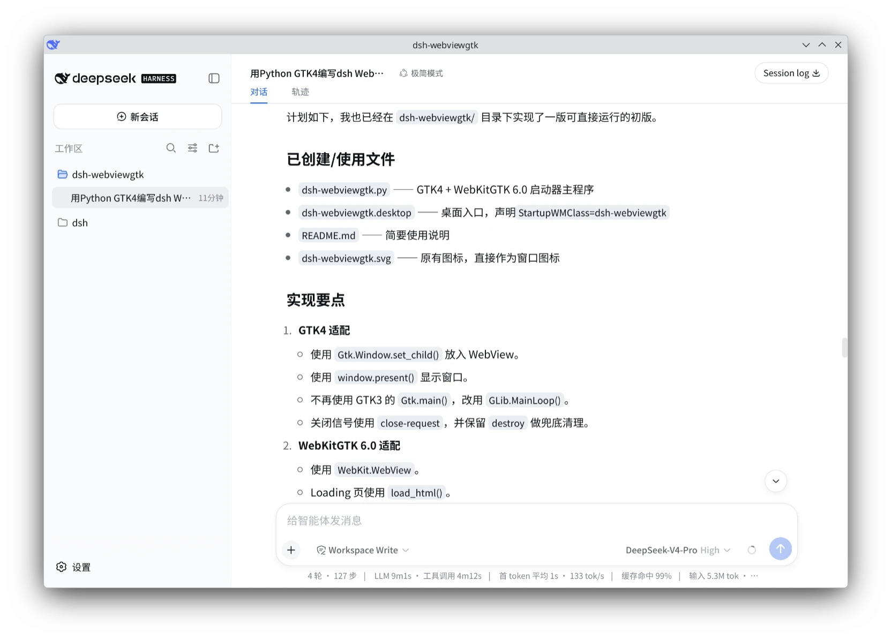

# dsh-webviewgtk

基于 GTK4 + WebKitGTK 6.0 的 dsh web 启动器。

可以作为 [deepseek-harness](https://github.com/deepseek-ai/deepseek-harness/) 的 gtk4 desktop 桌面版使用。

注：这只是一个启动器，不包含 dsh，也不预装任何额外插件，

启动时会执行 `npx --loglevel verbose --yes @deepseek-ai/dsh web --no-open --port 3081`

目的是保证使用的是最新版官方 dsh。

## 截图



## 依赖

Debian/Ubuntu：

```bash
sudo apt install python3-gi gir1.2-gtk-4.0 gir1.2-webkit-6.0
```

还需要 `npx` 命令在 `PATH` 中。

## 下载

```bash
git clone https://github.com/shellexy/dsh-webviewgtk.git
cd dsh-webviewgtk
```


## 直接运行

```bash
python3 dsh-webviewgtk.py
```

启动后会：

1. 打开 WebKitGTK 窗口，显示居中的图标和 `Loading...`；
2. 以子进程启动 `npx --loglevel verbose --yes @deepseek-ai/dsh web --no-open --port 3081`；
3. 把 dsh 的标准输出/错误同时显示在 Loading 页和终端，日志区域自动滚动到底部；
4. 从 dsh 输出中解析带 token 的访问地址（例如 `dsh web: http://127.0.0.1:3081/?token=...`），解析成功后自动加载该地址；
5. 支持从系统剪贴板粘贴图片到网页输入框；
6. 点击外链或请求新窗口的链接时，使用系统默认应用打开（支持 http、https、mailto、tel、ftp、magnet 等协议）；
7. 网页下载时弹出保存对话框；
8. 关闭窗口时结束整个 dsh 进程树。

## 安装

在仓库目录下执行：

```bash
pip install . --break-system-packages
```

或：

```bash
python3 setup.py install --user
```

安装后会提供 `dsh-webviewgtk` 命令，并安装：

- `dsh-webviewgtk` 启动命令
- `dsh-webviewgtk.svg` 图标到 hicolor 图标主题
- `dsh-webviewgtk.desktop` 到 applications 目录

## 图标与 StartupWMClass

- 窗口图标使用 `dsh-webviewgtk.svg`。
- 程序名/窗口类设置为 `dsh-webviewgtk`。
- `dsh-webviewgtk.desktop` 中声明了 `StartupWMClass=dsh-webviewgtk`。
